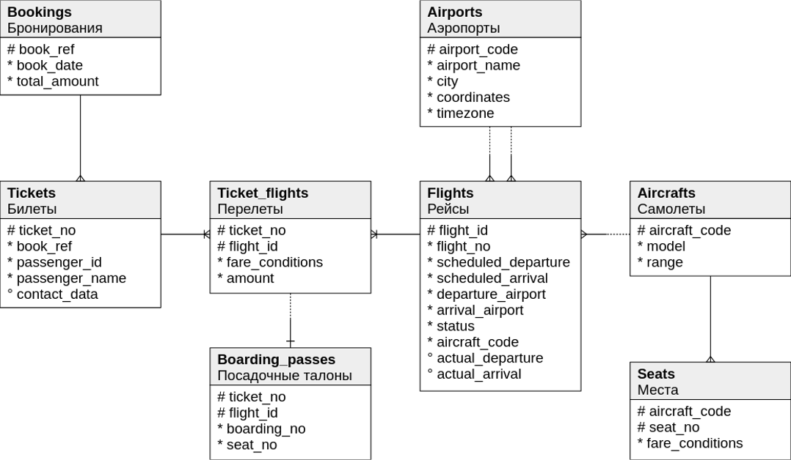

Air ticket booking
---
MIPT Project



### Структура проекта

```
.
├── Icon\r
├── README.md
├── checkstyle.xml
├── pom.xml
├── src
│   ├── main
│   │   ├── java
│   │   │   └── org
│   │   │       └── mipt
│   │   │           ├── App.java
│   │   │           ├── domain
│   │   │           │   ├── Aircrafts.java
│   │   │           │   ├── Airports.java
│   │   │           │   ├── BoardingPasses.java
│   │   │           │   ├── Bookings.java
│   │   │           │   ├── Flights.java
│   │   │           │   ├── Seats.java
│   │   │           │   ├── TicketFlights.java
│   │   │           │   └── Tickets.java
│   │   │           ├── jpa
│   │   │           │   └── HibernatePersistenceProvider.java
│   │   │           └── service
│   │   │               ├── dao
│   │   │               │   └── AircraftsDao.java
│   │   │               └── db
│   │   │                   ├── DbInit.java
│   │   │                   └── SimpleJdbcTemplate.java
│   │   └── resources
│   │       ├── META-INF
│   │       │   └── persistence.xml
│   │       ├── createDb.sql
│   │       ├── createTableAircrafts.sql
│   │       ├── createTableAirports.sql
│   │       ├── createTableBoardingPasses.sql
│   │       ├── createTableBookings.sql
│   │       ├── createTableFlights.sql
│   │       ├── createTableSeats.sql
│   │       ├── createTableTicketFlights.sql
│   │       ├── createTableTickets.sql
│   │       ├── dbcreate
│   │       ├── dropDb.sql
│   │       └── org.mipt
│   │           └── dbcreate.sql
│   └── test
│       └── java
│           └── org
│               └── mipt
│                   └── AppTest.java
└── Схема_БД.png

```
